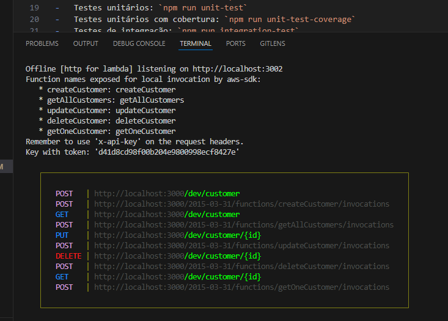

### Local environment setup

Open the terminal at the root of the repository and run these commands (you must have nodejs and npm installed):

1 - `npm i`

2 - `npx sls`

3 - `npx sls dynamodb install`

4 - `npx tsc`

5 - `npm run dev`

### Tests

Below are the commands to run the tests. For integration tests, you need to have the local dev server running (follow the "Local environment setup").
The test commands are:

-   All tests with coverage: `npm run test`
-   Unit tests: `npm run unit-test`
-   Unit tests with coverage: `npm run unit-test-coverage`
-   Integration tests: `npm run integration-test`

If necessary, the value of "x-api-key" within the request headers in the integration tests should be changed to the value that appears in the terminal when the local server is started on your machine, for example:

### Examples

To access the routes through Postman, you must use the API key shown in the print of the "Tests" section. Remember to also change the IDs that are in the example routes, use the ID that is returned after executing the POST route. Examples of how to execute requests in Postman: https://documenter.getpostman.com/view/3176597/2sAYX8HLtD
